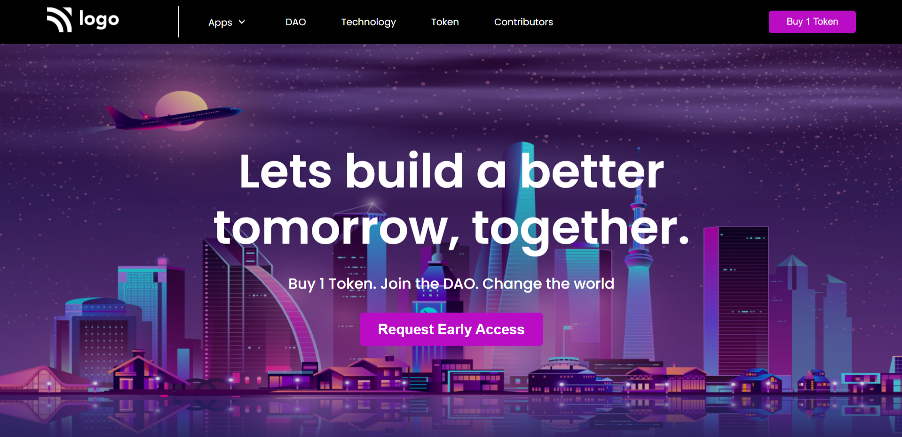

# Project_05 - HTML  and CSS 

---

## Project 05 [Live Link](https://project-05-themohitgupta.netlify.app)

---
## What I learned from this Project?

- Learned about **layout**.
- Learned about **Sticky Navbar**.
- Learned about **pseudo elements**.
- Learned about desiging **buttons** and **navbar**.
- Learned about adding different **fonts** from **Google Fonts**.

---

### This Project too me around **2 hours** to complete.

---

---
